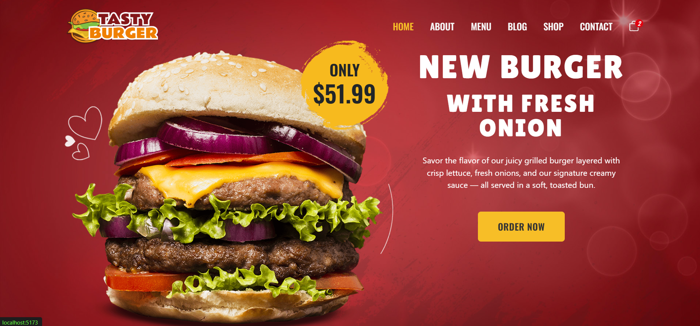
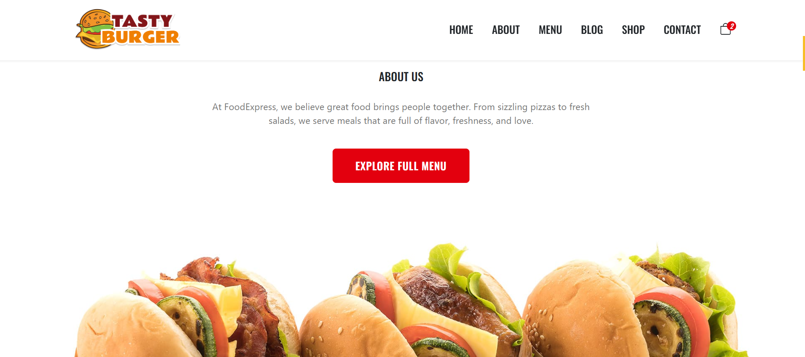
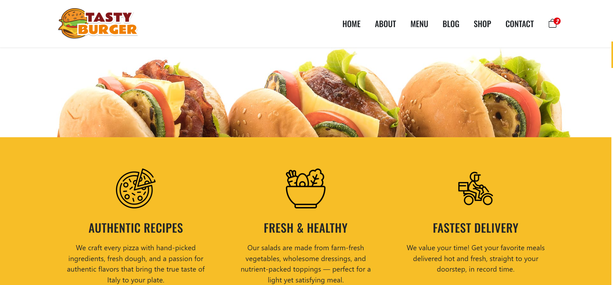
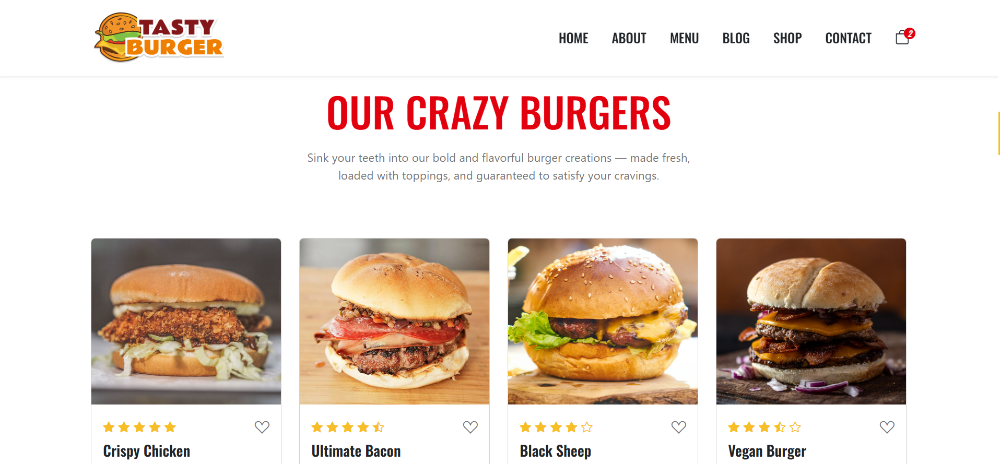
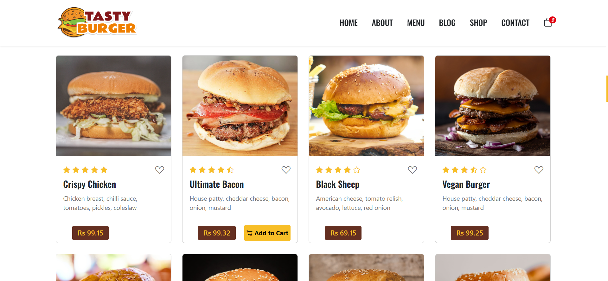
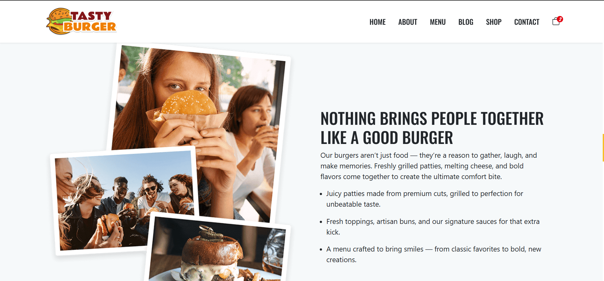
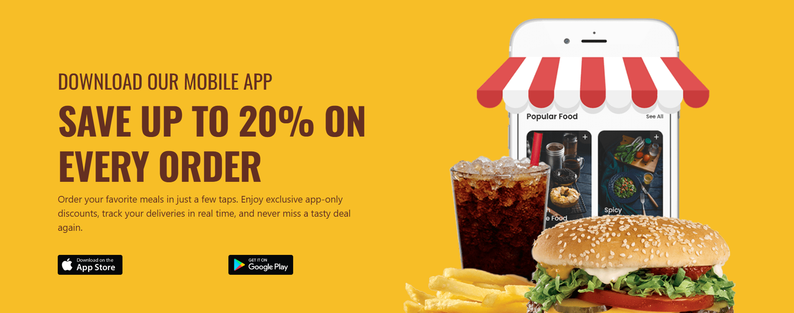
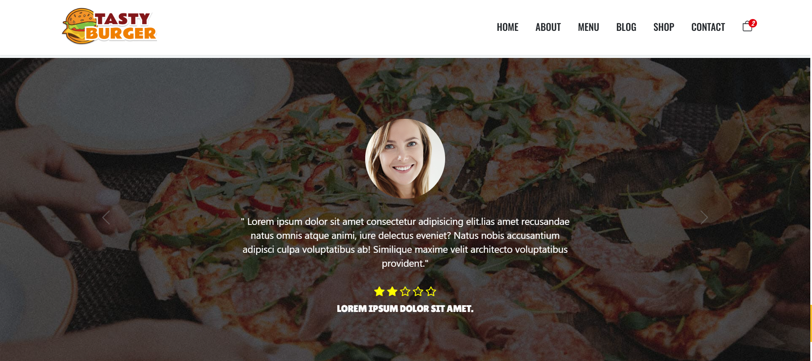
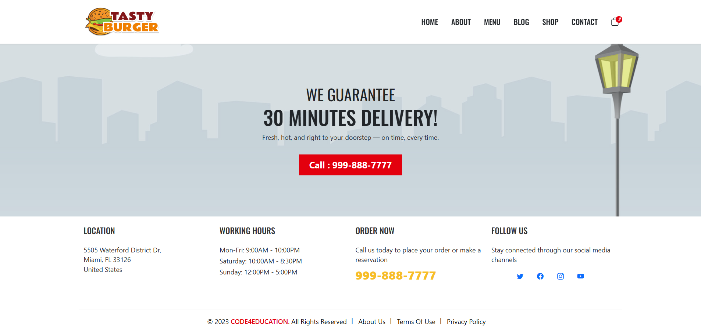

#  FoodCourts

Live Demo: https://foodcourts.surge.sh


## About
FoodCourts is a ReactJS-powered web app showcasing various food court venues with responsive design.

## Tech Stack
- ReactJS
- CSS (Grid, Flexbox, Responsive media queries)
- Surge (deployment)

## Getting Started
```bash
git clone https://github.com/Akshay1737/Reactjs.git
cd Reactjs
npm install
npm start

```


## 📸 Screenshots











